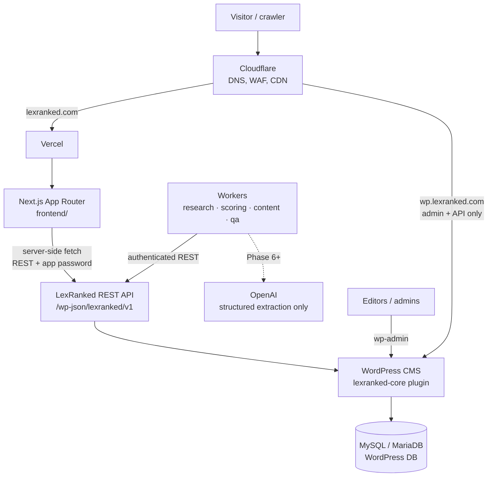

# Architecture

LexRanked is a **headless** platform. WordPress is the CMS and administrative
backend; a Next.js application is the only public frontend.

## System diagram



ASCII fallback:

```
Cloudflare ──▶ Vercel ──▶ Next.js frontend ──▶ LexRanked REST API ──▶ WordPress + lexranked-core ──▶ Database
                                                        ▲
                                         Workers ───────┘  (research, scoring, content, QA)
```

## Responsibilities

| Layer | Owns | Must not |
|-------|------|----------|
| Next.js (`frontend/`) | Rendering, routing, SEO metadata, JSON-LD, sitemap, caching/revalidation | Contain ranking or verification logic; hold secrets in client bundles |
| REST API (`lexranked/v1`) | Stable DTOs, validation, pagination, permissions | Return raw `WP_Post` objects or private fields |
| `lexranked-core` plugin | Entities, evidence, verification, ranking engine, admin UI, audit logs | Depend on a theme |
| WordPress | Storage, users/capabilities, editorial workflow | Serve the public site |
| Workers (`workers/`) | Long-running research, recalculation, drafting, QA | Write directly to the database, publish content, or decide rankings with an LLM |

## Repository layout

```
frontend/                      Next.js (App Router, TypeScript)
wordpress/plugins/lexranked-core/  All LexRanked business logic (PHP)
workers/                       Background jobs (Phase 4+)
database/                      Reference schema + migrations
scripts/                       Developer tooling (scripts/check.sh = CI locally)
docs/                          Documentation (this folder)
.github/workflows/             CI
```

## Architectural decisions

Each decision is recorded here with its rationale. Add new entries rather than
editing old ones; mark superseded entries.

### ADR-001 — Headless WordPress + Next.js
WordPress gives editors a mature admin, users/capabilities, revisions and
drafts. Next.js gives SEO control, server rendering and edge caching on
Vercel. The public site never uses a WordPress theme; `wp.lexranked.com` is
admin/API only and should be `noindex` and firewalled at Cloudflare.

### ADR-002 — Business logic lives in the `lexranked-core` plugin
One plugin, namespaced `LexRanked\Core`, PSR-4 under `src/`. The plugin
ships its own tiny autoloader so production needs no `vendor/`; Composer is
used only for development tooling (PHPUnit, PHPCS).

### ADR-003 — Stable DTOs are the contract
The frontend consumes versioned DTOs (`docs/api.md`), not WordPress objects.
This is the seam that allows moving ranking/research data to PostgreSQL later
without a frontend rewrite.

### ADR-004 — WordPress database first, PostgreSQL later (maybe)
Custom post types + meta for editorial entities; dedicated custom tables for
high-volume, append-only data (evidence claims, ranking snapshots, audit
log). No PostgreSQL until volume or query needs justify the extra
infrastructure.

### ADR-005 — Deterministic ranking; AI is never the ranker
Scores are pure functions of stored data + a versioned weight configuration
(`docs/ranking-methodology.md`). LLMs may classify/extract/draft, always with
schema-validated output, never decide positions or invent facts.

### ADR-006 — Organic score and commercial status are separate
Payment state is stored in a separate structure and is never an input to the
score calculator. This is enforced by code structure and tests (Phase 4/9).

### ADR-007 — Trailing-slash canonical URLs
`trailingSlash: true` in Next.js; every page has exactly one canonical URL
(`/lawyers/john-smith/`).

### ADR-008 — Indexing is opt-in
`robots.txt` disallows everything unless `ALLOW_INDEXING=true`, and preview
deployments are always `noindex`. Prevents pre-launch or preview pages from
being indexed.

### ADR-009 — Minimal dependencies
Phase 1 frontend runtime dependencies are only `next`, `react`, `react-dom`
and `server-only` (build-time guard that prevents server modules — and
therefore secrets — from being imported into client components). Styling uses
plain CSS with design tokens; no CSS framework yet. Dev-only: ESLint
(`eslint-config-next`), TypeScript, Vitest (fast, ESM-native unit tests).
Plugin dev-only: PHPUnit, WordPress Coding Standards, PHPCompatibilityWP.

### ADR-010 — CPTs are not exposed through `/wp/v2`
All LexRanked post types use `show_in_rest = false` and the classic editor
with a generated "Structured data" meta box. The only public contract is
`lexranked/v1` with DTOs, so private fields can never leak through core
endpoints and the frontend never couples to WordPress internals. Anonymous
access to `/wp/v2/users` is also removed (user enumeration).

### ADR-011 — One field schema per entity
`Schema\Field` definitions in each `PostTypes/*` class are the single source
for meta registration, admin forms, validation (`FieldSanitizer`), storage
(`MetaCodec`) and DTO mapping. Validation is pure PHP and unit-tested;
empty input is stored as absence (unknown), never as a guess.

### ADR-012 — Verification status is derived at read time
Profile verification is computed from verification records by
`VerificationPolicy` on every read (batched per request). Expiry therefore
takes effect immediately without cron jobs, and no editor can mark a profile
"verified" by hand.

### ADR-013 — Pure mappers, thin WordPress adapters
`EntityRepository` is the only class that reads `WP_Post`/meta/terms and
produces plain arrays; `REST/DTO/*` mappers are pure functions of those
arrays. This keeps the API testable without WordPress and is the seam for a
future storage migration (ADR-003/004).

### ADR-014 — Demo data policy
Mock data exists only through `wp lexranked seed-demo`, is flagged
`is_demo`, uses reserved/fictional identifiers (example.com, 555-01xx,
"(Demo)" names, score version `demo`), is exposed as `isDemo`, and demo
rankings are never indexable. `purge-demo` removes it.

### ADR-015 — Frontend authenticates only to avoid rate limits
The Next.js server uses an Application Password of a `lexranked_api` user
(no editing capabilities). It only ever requests `context=view` data, so
responses are safe to cache in the Next data cache. Credentials are read in
`server-only` modules and never reach client bundles.

### ADR-016 — Page existence and indexability rules live in one module
`frontend/lib/content/eligibility.ts` decides which pages exist and which
are indexable:
- Rankings exist unless thin.
- State, city and practice-area hubs exist with ≥ 3 published lawyers.
- Pages built from demo data are always `noindex`.

The pages, the robots meta tags and the sitemap all use these rules, so they
cannot disagree.

### ADR-017 — Canonical ranking URLs are location paths
`/rankings/{state}/{city?}/{practice-area?}/` is canonical and comes from the
API's ranking `path`. A bare `/rankings/{slug}/` permanently redirects to it.
Lawyer and firm profiles accessed by numeric ID also redirect to the slug URL.

### ADR-018 — ISR with graceful degradation
Public pages revalidate every 5 minutes. Dynamic segments use an empty
`generateStaticParams`, so each page is rendered on its first request and
then cached. Listing pages turn API failures into a visible "temporarily
unavailable" state and are served `noindex`; they do not crash. The build
therefore succeeds without WordPress, as in CI.

### ADR-019 — Structured data without review markup
Pages emit the following JSON-LD:
- Organization and WebSite (with a search action) on the home page;
- Person on lawyer profiles;
- LegalService on firm profiles;
- ItemList on rankings;
- CollectionPage on hubs;
- BreadcrumbList everywhere.

Pages do **not** emit `AggregateRating`. The ratings come from third-party
platforms, and search-engine guidelines allow review markup only for reviews
the site collects itself.

### ADR-020 — Engine output is stored, not recomputed on read
Rankings and profile breakdowns are served from the latest snapshot run.
The API never scores on the fly, which keeps reads fast and makes every
number the public sees traceable to a stored, reproducible calculation.
Snapshots store the inputs, so later data changes never rewrite history.
Recalculation happens daily, shortly after edits (debounced) and on demand.

### ADR-021 — Workers propose, WordPress disposes
Research workers are untrusted clients with a narrow role
(`lexranked_worker`). They submit candidates, sources, claims and
verification requests through the private research API; the plugin
validates, deduplicates and applies them by fixed rules (matching,
fact resolution, tier caps on verification). Workers never write to the
database, never publish, and never see private fields.

### ADR-022 — Durable job queue on WordPress posts with leases
Jobs are `lr_research_job` posts; a claim takes a MySQL advisory lock and
hands out a time-limited lease token that every write must present. A dead
worker's lease expires and the job resumes from its cursor; failures retry
with exponential backoff. This avoids adding Redis/SQS while the volume is
small; the API contract (claim/heartbeat/complete/fail) lets the queue move
to a dedicated system later without changing workers.

### ADR-023 — Research never publishes; evidence about public profiles is reviewed
New entities are drafts; research evidence about a published entity is
stored with `review_status = pending_review` and is invisible to the public
API and the ranking engine until an editor approves it on **Research
review**. Automated verification records are `pending` posts. Publication is
always a human action.

### ADR-024 — Structured data only, from curated seeds
Candidate discovery starts from human-curated datasets that name their
source; the worker does not crawl directories. Web facts come only from
schema.org JSON-LD a site publishes about the same entity (name-matched),
fetched politely (robots.txt, rate limits, SSRF guard). Free-text or
AI-based extraction (Phase 6) must go through the same intake.
