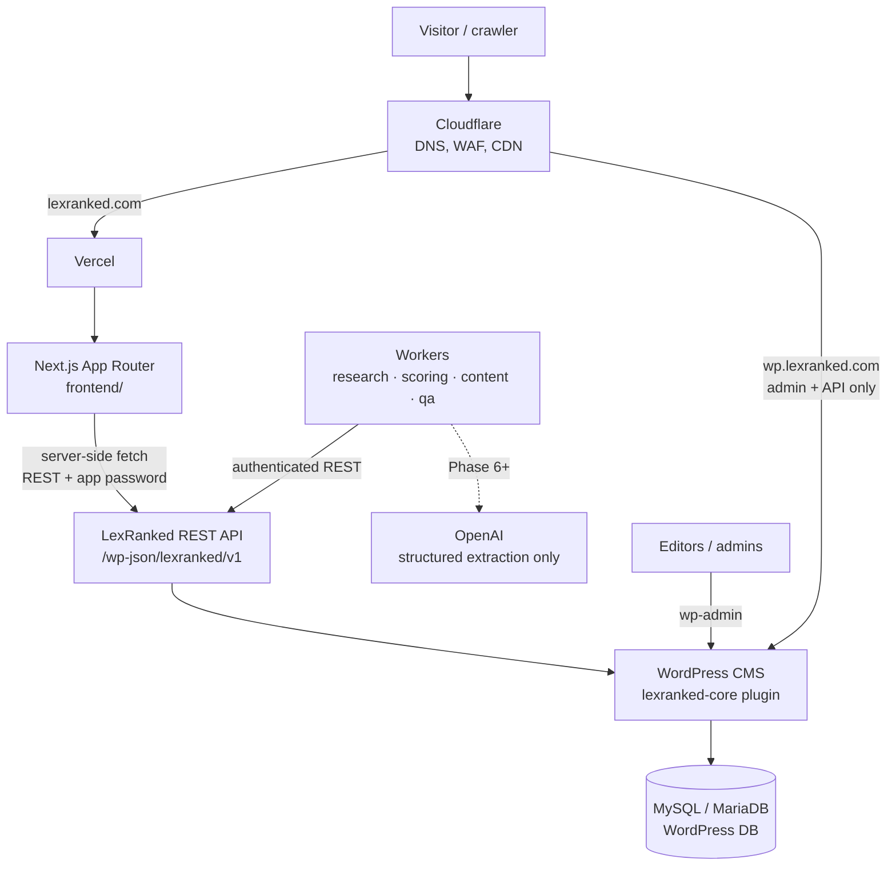

# Architecture

LexRanked is a **headless** platform. WordPress is the CMS and administrative
backend; a Next.js application is the only public frontend.

## System diagram



ASCII fallback:

```
Cloudflare ──▶ Vercel ──▶ Next.js frontend ──▶ LexRanked REST API ──▶ WordPress + lexranked-core ──▶ Database
                                                        ▲
                                         Workers ───────┘  (research, scoring, content, QA)
```

## Responsibilities

| Layer | Owns | Must not |
|-------|------|----------|
| Next.js (`frontend/`) | Rendering, routing, SEO metadata, JSON-LD, sitemap, caching/revalidation | Contain ranking or verification logic; hold secrets in client bundles |
| REST API (`lexranked/v1`) | Stable DTOs, validation, pagination, permissions | Return raw `WP_Post` objects or private fields |
| `lexranked-core` plugin | Entities, evidence, verification, ranking engine, admin UI, audit logs | Depend on a theme |
| WordPress | Storage, users/capabilities, editorial workflow | Serve the public site |
| Workers (`workers/`) | Long-running research, recalculation, drafting, QA | Write directly to the database, publish content, or decide rankings with an LLM |

## Repository layout

```
frontend/                      Next.js (App Router, TypeScript)
wordpress/plugins/lexranked-core/  All LexRanked business logic (PHP)
workers/                       Background jobs (Phase 4+)
database/                      Reference schema + migrations
scripts/                       Developer tooling (scripts/check.sh = CI locally)
docs/                          Documentation (this folder)
.github/workflows/             CI
```

## Architectural decisions

Each decision is recorded here with its rationale. Add new entries rather than
editing old ones; mark superseded entries.

### ADR-001 — Headless WordPress + Next.js
WordPress gives editors a mature admin, users/capabilities, revisions and
drafts. Next.js gives SEO control, server rendering and edge caching on
Vercel. The public site never uses a WordPress theme; `wp.lexranked.com` is
admin/API only and should be `noindex` and firewalled at Cloudflare.

### ADR-002 — Business logic lives in the `lexranked-core` plugin
One plugin, namespaced `LexRanked\Core`, PSR-4 under `src/`. The plugin
ships its own tiny autoloader so production needs no `vendor/`; Composer is
used only for development tooling (PHPUnit, PHPCS).

### ADR-003 — Stable DTOs are the contract
The frontend consumes versioned DTOs (`docs/api.md`), not WordPress objects.
This is the seam that allows moving ranking/research data to PostgreSQL later
without a frontend rewrite.

### ADR-004 — WordPress database first, PostgreSQL later (maybe)
Custom post types + meta for editorial entities; dedicated custom tables for
high-volume, append-only data (evidence claims, ranking snapshots, audit
log). No PostgreSQL until volume or query needs justify the extra
infrastructure.

### ADR-005 — Deterministic ranking; AI is never the ranker
Scores are pure functions of stored data + a versioned weight configuration
(`docs/ranking-methodology.md`). LLMs may classify/extract/draft, always with
schema-validated output, never decide positions or invent facts.

### ADR-006 — Organic score and commercial status are separate
Payment state is stored in a separate structure and is never an input to the
score calculator. This is enforced by code structure and tests (Phase 4/9).

### ADR-007 — Trailing-slash canonical URLs
`trailingSlash: true` in Next.js; every page has exactly one canonical URL
(`/lawyers/john-smith/`).

### ADR-008 — Indexing is opt-in
`robots.txt` disallows everything unless `ALLOW_INDEXING=true`, and preview
deployments are always `noindex`. Prevents pre-launch or preview pages from
being indexed.

### ADR-009 — Minimal dependencies
Phase 1 frontend runtime dependencies are only `next`, `react`, `react-dom`
and `server-only` (build-time guard that prevents server modules — and
therefore secrets — from being imported into client components). Styling uses
plain CSS with design tokens; no CSS framework yet. Dev-only: ESLint
(`eslint-config-next`), TypeScript, Vitest (fast, ESM-native unit tests).
Plugin dev-only: PHPUnit, WordPress Coding Standards, PHPCompatibilityWP.

### ADR-010 — CPTs are not exposed through `/wp/v2`
All LexRanked post types use `show_in_rest = false` and the classic editor
with a generated "Structured data" meta box. The only public contract is
`lexranked/v1` with DTOs, so private fields can never leak through core
endpoints and the frontend never couples to WordPress internals. Anonymous
access to `/wp/v2/users` is also removed (user enumeration).

### ADR-011 — One field schema per entity
`Schema\Field` definitions in each `PostTypes/*` class are the single source
for meta registration, admin forms, validation (`FieldSanitizer`), storage
(`MetaCodec`) and DTO mapping. Validation is pure PHP and unit-tested;
empty input is stored as absence (unknown), never as a guess.

### ADR-012 — Verification status is derived at read time
Profile verification is computed from verification records by
`VerificationPolicy` on every read (batched per request). Expiry therefore
takes effect immediately without cron jobs, and no editor can mark a profile
"verified" by hand.

### ADR-013 — Pure mappers, thin WordPress adapters
`EntityRepository` is the only class that reads `WP_Post`/meta/terms and
produces plain arrays; `REST/DTO/*` mappers are pure functions of those
arrays. This keeps the API testable without WordPress and is the seam for a
future storage migration (ADR-003/004).

### ADR-014 — Demo data policy
Mock data exists only through `wp lexranked seed-demo`, is flagged
`is_demo`, uses reserved/fictional identifiers (example.com, 555-01xx,
"(Demo)" names, score version `demo`), is exposed as `isDemo`, and demo
rankings are never indexable. `purge-demo` removes it.

### ADR-015 — Frontend authenticates only to avoid rate limits
The Next.js server uses an Application Password of a `lexranked_api` user
(no editing capabilities). It only ever requests `context=view` data, so
responses are safe to cache in the Next data cache. Credentials are read in
`server-only` modules and never reach client bundles.
